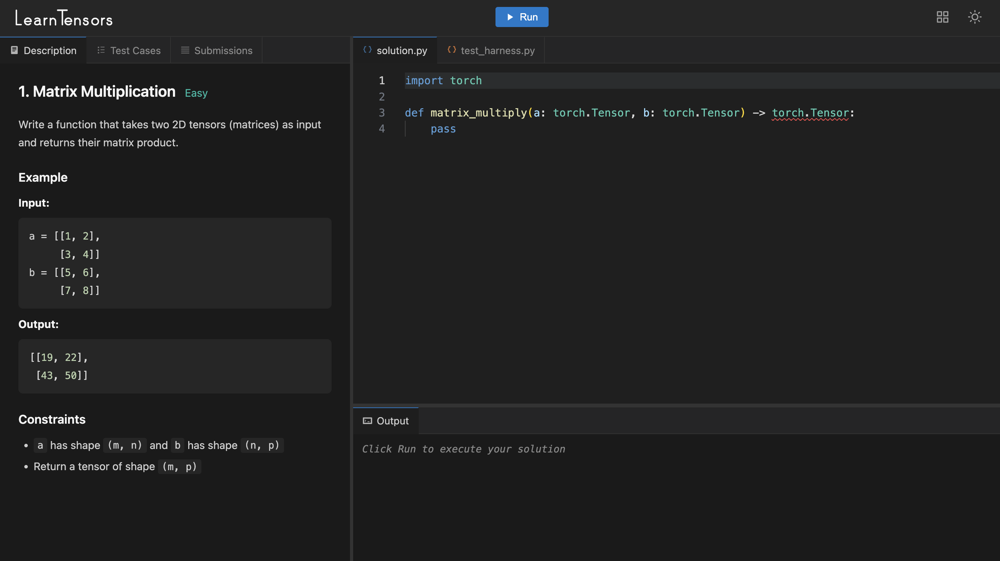

# reactive-layout

A Vue 3 layout engine for building split-pane, tabbed interfaces with drag-and-drop. Think VS Code's panel system — resizable splits, draggable tabs, and drop-to-split — as a reusable package.



## Install

```bash
npm install reactive-layout
```

Vue 3 is a peer dependency.

## Quick Start

```vue
<script setup>
import { provide } from "vue";
import { useLayout, SplitLayout } from "reactive-layout";
import MyPanelContent from "./MyPanelContent.vue";
import MyTabIcon from "./MyTabIcon.vue";

const { layout, moveTab, splitPanel, updateSizesForSplit } = useLayout({
  defaultLayout: {
    type: "split",
    direction: "horizontal",
    sizes: [30, 70],
    children: [
      {
        type: "panel",
        id: "sidebar",
        tabs: [{ id: "files", panelType: "files", label: "Files" }],
        activeTabId: "files",
      },
      {
        type: "panel",
        id: "main",
        tabs: [{ id: "editor", panelType: "editor", label: "Editor" }],
        activeTabId: "editor",
      },
    ],
  },
  storageKey: "my-app-layout",
});

// Required by the layout components
provide("moveTab", moveTab);
provide("closeTab", (tabId) => removeTab(tabId));
provide("splitPanel", splitPanel);
provide("updateSizesForSplit", updateSizesForSplit);

// Your app-specific renderers
provide("layoutPanelContent", MyPanelContent);
provide("layoutTabIcon", MyTabIcon);
</script>

<template>
  <SplitLayout :node="layout" />
</template>
```

## Concepts

The layout is a tree of two node types:

- **SplitNode** — a container that arranges its children horizontally or vertically with resizable dividers
- **PanelNode** — a leaf with a tab bar and content area

```
SplitNode (horizontal)
├── PanelNode "sidebar" [Files, Search]
└── SplitNode (vertical)
    ├── PanelNode "editor" [main.ts, utils.ts]
    └── PanelNode "terminal" [Terminal]
```

## API

### `useLayout(options)`

Creates and manages a reactive layout tree.

**Options:**

| Option | Type | Description |
|---|---|---|
| `defaultLayout` | `SplitNode` | The initial layout tree |
| `storageKey` | `string?` | localStorage key for persistence. Omit to disable. |

**Returns:**

| Property | Description |
|---|---|
| `layout` | `Ref<SplitNode>` — the reactive layout tree, pass to `<SplitLayout>` |
| `moveTab(tabId, fromPanelId, toPanelId, insertIndex?)` | Move or reorder a tab |
| `addTab(nearTabId, tab, activate?)` | Add a tab to the panel containing `nearTabId` |
| `removeTab(tabId)` | Remove a tab (cleans up empty panels) |
| `splitPanel(panelId, direction, tabId, position)` | Split a panel by pulling a tab into a new pane |
| `updateSizesForSplit(split, newSizes)` | Update pane sizes after a resize |
| `resetLayout()` | Reset to `defaultLayout` and clear storage |
| `findPanelById(id)` | Find a panel node by ID |

### Components

#### `<SplitLayout :node="layout" />`

Recursively renders the layout tree. Renders `LayoutPanel` for leaf nodes and nested `SplitLayout` with `ResizeHandle` dividers for splits.

#### `<LayoutPanel :panel="panelNode" />`

Renders a tab bar with drag-and-drop support and a content area. Used internally by `SplitLayout` — you don't render this directly.

#### `<ResizeHandle :direction="'horizontal' | 'vertical'" />`

A draggable divider between split panes. Emits `resize(delta)` and `resizeEnd` events. Used internally by `SplitLayout`.

## Provide/Inject

The layout components expect these injections:

### Required (from `useLayout`)

| Key | Type | Description |
|---|---|---|
| `moveTab` | `(tabId, fromPanelId, toPanelId, insertIndex?) => void` | Tab move handler |
| `closeTab` | `(tabId) => void` | Tab close handler |
| `splitPanel` | `(panelId, direction, tabId, position) => void` | Panel split handler |
| `updateSizesForSplit` | `(split, newSizes) => void` | Resize handler |

### App-Specific Renderers

| Key | Type | Description |
|---|---|---|
| `layoutPanelContent` | Vue Component | Receives `activeTab` prop, renders the panel body |
| `layoutTabIcon` | Vue Component | Receives `tab` prop, renders the tab icon |

### Panel Content Component

Your content component receives the active tab and renders whatever your app needs:

```vue
<script setup>
import type { PanelTab } from "reactive-layout";

defineProps<{ activeTab: PanelTab }>();
</script>

<template>
  <FileExplorer v-if="activeTab.panelType === 'files'" />
  <CodeEditor v-else-if="activeTab.panelType === 'editor'" />
  <Terminal v-else-if="activeTab.panelType === 'terminal'" />
</template>
```

### Tab Icon Component

```vue
<script setup>
import type { PanelTab } from "reactive-layout";

defineProps<{ tab: PanelTab }>();
</script>

<template>
  <span class="icon">{{ tab.panelType === 'files' ? '📁' : '📄' }}</span>
</template>
```

## Types

```typescript
interface PanelTab {
  id: string;
  panelType: string;
  label: string;
  closable?: boolean;
}

interface PanelNode {
  type: "panel";
  id: string;
  tabs: PanelTab[];
  activeTabId: string;
}

interface SplitNode {
  type: "split";
  direction: "horizontal" | "vertical";
  children: LayoutNode[];
  sizes: number[];  // percentages, must sum to 100
}

type LayoutNode = SplitNode | PanelNode;
```

## Features

- Recursive split panes (nest as deep as you want)
- Drag tabs between panels or reorder within a panel
- Drop on panel edges to split horizontally/vertical
- Resizable panes with 5% minimum size
- Optional localStorage persistence with debounced saves
- SSR-safe (no window/localStorage access during server render)
- Zero dependencies beyond Vue 3

## CSS Variables

The components use CSS custom properties for theming:

| Variable | Default | Usage |
|---|---|---|
| `--bg` | `#1e1e1e` | Panel content background, active tab background |
| `--bg3` | `#252526` | Tab bar background, inactive tab background |
| `--border` | `#333` | Borders, resize handle color |
| `--fg` | `#fff` | Tab close button hover color |
| `--fg2` | `#ccc` | Active tab text, tab hover text |

## License

MIT
